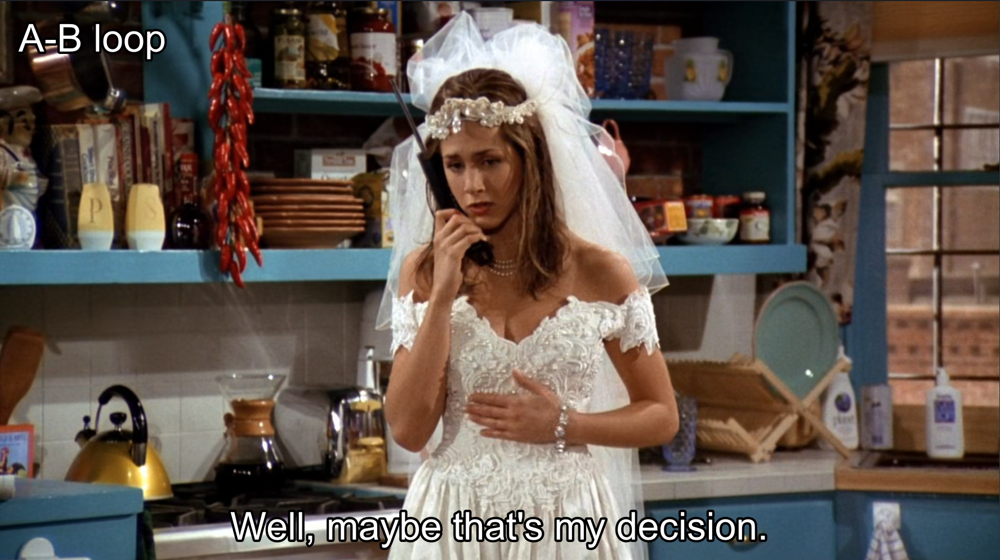

# Sobre
Aqui estão alguns scripts que eu criei para o meu MPV, com o objetivo de melhorar meu vocabulário e minha habilidade de listening em inglês. É excelente para criar cards no Anki com áudio nativo.

## Instalação
Coloque os scripts na pasta de scripts do MPV:
* Windows `C:/Users/Username/AppData/Roaming/mpv/scripts/`

O `slicing_mp3.js` vai precisar do ffmpeg definido no PATH do Windows para funcionar.

* [ffmpeg](https://ffmpeg.org/download.html)

## Uso

### copy_subtitle.js
Para copiar a legenda para área de transferência o atalho é `Ctrl+c`.

`Well, maybe that's my decision.`

### replay_subtitle.js
Para criar um loop na legenda o atalho é `r`.

`Well, maybe that's my decision.`
### slicing_mp3.js
Para criar um fragmento de áudio do loop o atalho é `Ctrl+s`.

https://github.com/Luan-Ferreira-Dev/mpv-scripts/assets/111436664/4b3de5fa-66ed-47b0-8899-4f72a1330190

